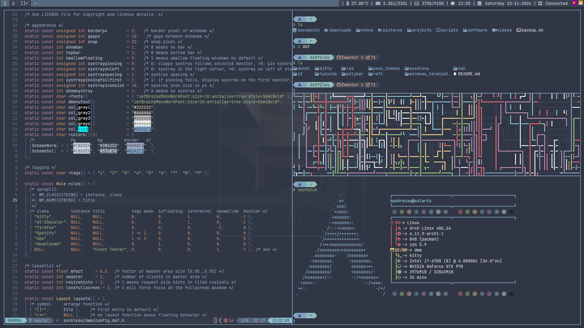

# Personal Dotfiles

This repository contains my personal dotfiles. It is a **work in progress**, so not everything is fully configured or polished yet.
My current working station is an Arch Linux machine.
The current color scheme I'm obsessed with right now is Nord, so all the configurations are made to match its palette.

## Current State

- Basic configurations for shell, editor, and other tools.
- Still in progress, feel free to check back later for more updates and guides.

# TODO

- [ ] Dynamically change colorscheme on the fly
- [ ] Improve documentation for each technology
- [ ] Automate installation process for dependencies
- [ ] Test on a clean machine
- [ ] Update README with more details about usage

## Pictures

  

  

